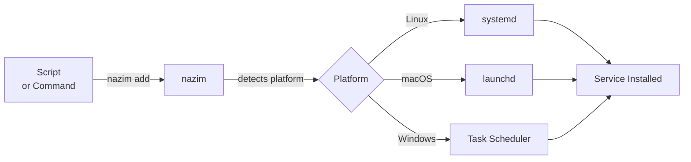

# nazim (ناظم)

[](https://github.com/calilkhalil/nazim/actions)
[](https://opensource.org/licenses/MIT)
[](https://golang.org)
[](https://goreportcard.com/report/github.com/calilkhalil/nazim)

> Multi-OS service manager. Create and manage services (scripts/commands) that can be executed on system startup or at regular intervals.

*nazim* (ناظم) means "organizer" or "manager" in Arabic — what this tool does for your system services.

## Why?

Managing system services across different operating systems is boring. Each platform has its own mechanism:
- **Windows**: Task Scheduler
- **Linux**: systemd
- **macOS**: launchd

**nazim simplifies this.** It provides a unified CLI to manage services across all platforms. Write your service once, and nazim handles the platform-specific installation automatically.



## Features

- **Multi-Platform**: Works on Windows, Linux, and macOS
- **Startup Services**: Run commands automatically on system boot
- **Scheduled Execution**: Execute services at regular intervals (minutes, hours, days)
- **Interactive Editor**: Use `--command write` to open your default editor and create scripts
- **Simple CLI**: Easy-to-use command-line interface
- **XDG Compliant**: Follows XDG Base Directory Specification for config files
- **Minimal Dependencies**: Uses Go standard library, YAML parser, and Windows API for UAC elevation

## Quick Start

```sh
# Clone and build
git clone https://github.com/calilkhalil/nazim
cd nazim
make build

# Or install directly
make install-user  # Installs to ~/.local/bin
```

Add your first service:

```sh
# Simple one-liner: clean temp files every hour
nazim add --name cleanup --command "rm -rf /tmp/old_files" --interval 1h

# Or use a script file
nazim add --name backup --command backup.sh --interval 1h

# Or use interactive mode to write a script
nazim add --name myscript --command write --interval 1h
```

## Installation

### From Source

```sh
git clone https://github.com/calilkhalil/nazim
cd nazim
make build
sudo make install       # System-wide installation
make install-user       # User installation (~/.local/bin)
```

### Using Go Install

```sh
go install github.com/calilkhalil/nazim/cmd/nazim@latest
```

## Usage

nazim stores service configuration in `~/.config/nazim/services.yaml` (or `%APPDATA%\nazim\services.yaml` on Windows).

### Basic Commands

```sh
# Add a service with a simple command (oneliner)
nazim add --name "cleanup" --command "rm -rf /tmp/old_files" --interval "1h"

# Add a service with a script file
nazim add --name "backup" --command "backup.sh" --interval "1h"

# Add a service that runs on startup
nazim add --name "init" --command "init.sh" --on-startup

# Interactive mode: open editor to write script
nazim add --name "myscript" --command write --interval "30m"

# List all services
nazim list

# Remove a service
nazim remove backup

# Start a service manually
nazim start backup

# Stop a service
nazim stop backup
```

### Examples

#### Simple One-liner Commands

```sh
# Clean up temporary files every hour
nazim add --name "cleanup-tmp" --command "rm -rf /tmp/old_files" --interval "1h"

# Run a backup command every day
nazim add --name "daily-backup" --command "tar -czf /backup/data-$(date +%Y%m%d).tar.gz /data" --interval "24h"

# Send a notification on startup
nazim add --name "startup-notify" --command "curl -X POST https://api.example.com/notify" --on-startup

# Windows: Clean temp files
nazim add --name "clean-temp" --command "del /Q C:\temp\*.tmp" --interval "30m"
```

#### Script Files

```sh
# Add a service that runs a script every 5 minutes
nazim add --name "monitor" --command "monitor.sh" --interval "5m"

# Add a service that runs on system startup
nazim add --name "init-script" --command "init.sh" --on-startup
```

#### Interactive Mode (Write Script in Editor)

```sh
# Open your default editor to write a script
# The script will be saved in ~/.config/nazim/scripts/
nazim add --name "custom-task" --command write --interval "1h"
```

#### Commands with Arguments

```sh
# Add a service with arguments and working directory
nazim add --name "processor" \
  --command "python" \
  --args "process.py --verbose" \
  --workdir "/opt/app" \
  --interval "30m"

# One-liner with arguments (use quotes)
nazim add --name "log-analyzer" \
  --command "python" \
  --args "analyze.py --input /var/log/app.log --output /tmp/report.json" \
  --interval "15m"
```

#### Management

```sh
# List all services with status
nazim list

# Remove a service (also uninstalls from system)
nazim remove monitor
```

## Commands

```
nazim add <options>     add a new service
nazim list             list all services
nazim remove <name>    remove a service
nazim start <name>     start a service manually
nazim stop <name>      stop a service
```

### Add Command Options

- `-n, --name <name>`        service name (required)
- `-c, --command <cmd>`      command or script to execute (required)
                             - Simple command: `"rm -rf /tmp/old_files"`
                             - Script file: `backup.sh`
                             - Interactive: `write` or `edit` (opens editor)
- `-a, --args <args>`        arguments for the command (space-separated)
- `-w, --workdir <dir>`      working directory
- `--on-startup`             run on system startup
- `-i, --interval <dur>`     execution interval (e.g., 5m, 1h, 30s)

### Global Options

- `-v, --verbose`            enable verbose output
- `-h, --help`               show help

## Interval Format

Intervals can be specified using suffixes:
- `30s` - 30 seconds
- `5m` - 5 minutes
- `1h` - 1 hour
- `24h` - 24 hours
- `7d` - 7 days

## Configuration

Services are stored in YAML format at:
- **Linux/macOS**: `~/.config/nazim/services.yaml` (or `$XDG_CONFIG_HOME/nazim/services.yaml`)
- **Windows**: `%APPDATA%\nazim\services.yaml`

Example configuration:

```yaml
- name: backup
  command: backup.sh
  interval: 1h
  enabled: true
  platform: linux

- name: init-script
  command: init.sh
  on_startup: true
  enabled: true
  platform: linux
```

## Environment Variables

| Variable | Description | Default |
|----------|-------------|---------|
| `NAZIM_VERBOSE` | Enable verbose output | (unset) |
| `EDITOR` | Default editor for interactive mode | Platform-specific (vim, nano, notepad, etc.) |
| `VISUAL` | Alternative editor variable | Same as EDITOR |
| `XDG_CONFIG_HOME` | Config directory | ~/.config (Linux/macOS), %APPDATA% (Windows) |

### Interactive Editor Mode

When using `--command write` or `--command edit`, nazim will:
1. Create a script template with:
   - Service name clearly marked
   - Section marked "YOUR CODE HERE" where you write your logic
   - Examples and comments to guide you
   - Proper shebang/header for your platform
2. Open your default editor (from `$EDITOR` or `$VISUAL` env vars)
3. Save the script in `~/.config/nazim/scripts/` (or equivalent)
4. Use the appropriate extension (`.sh` on Linux/macOS, `.bat` on Windows)
5. Make the script executable automatically

**Template Structure:**
- Header with service name, creation date, and location
- Clear section marked "YOUR CODE HERE" for your code
- Examples of common commands
- Proper exit codes

The editor priority:
- `$EDITOR` environment variable
- `$VISUAL` environment variable
- Platform defaults: `vim`, `nano`, `code` (VS Code), or `notepad` (Windows)

## Exit Codes

| Code | Meaning |
|------|---------|
| 0 | Success |
| 1 | Error |

## Platform Support

### Windows
- Uses **Task Scheduler** (`schtasks`) for service management
- Supports startup and scheduled execution
- Services are prefixed with `Nazim_` in Task Scheduler

### Linux
- Uses **systemd** (user services) exclusively
- Requires systemd to be available (most modern Linux distributions)
- Services are created in `~/.config/systemd/user/`
- Uses systemd timers for scheduled execution

### macOS
- Uses **launchd** for service management
- Services are created in `~/Library/LaunchAgents/`
- Supports startup and interval-based execution

## How It Works

1. **Add Service**: nazim validates the service configuration and saves it to YAML
2. **Install**: nazim creates the appropriate platform-specific service:
   - Windows: Task Scheduler entry
   - Linux: systemd service/timer
   - macOS: launchd plist file
3. **Manage**: You can list, start, stop, or remove services through the CLI
4. **Remove**: nazim uninstalls the service from the system and removes it from config

## Requirements

- Go 1.21 or higher (for building from source)
- Administrator/root permissions (for installing system services)
- Platform-specific tools:
  - Windows: `schtasks`
  - Linux: `systemctl`
  - macOS: `launchctl`

## Contributing

Contributions are welcome! Please read [CONTRIBUTING.md](CONTRIBUTING.md) for guidelines.

## License

MIT License - see [LICENSE](LICENSE) file for details.
